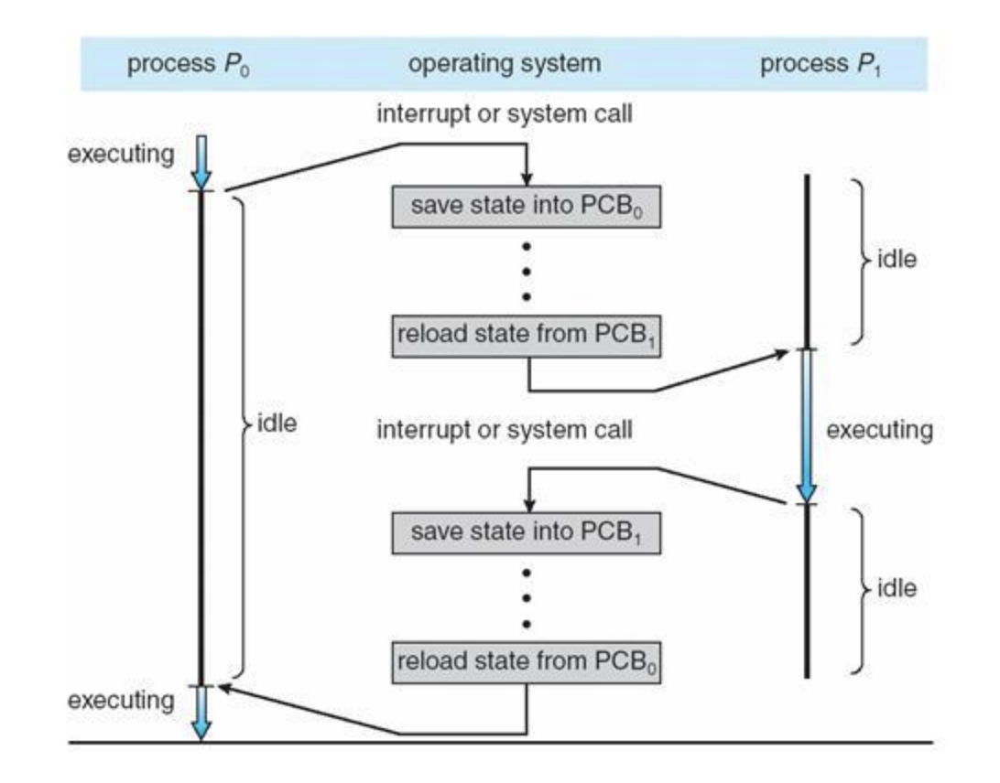
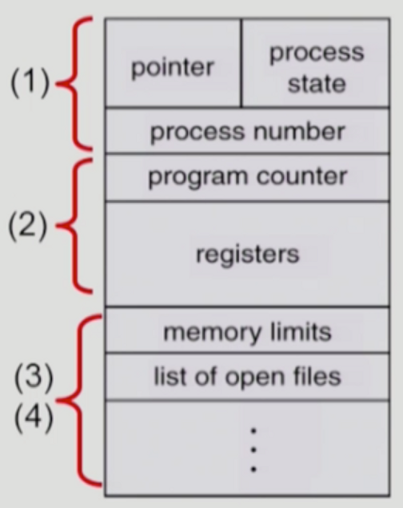

# 🗯️ 문맥 교환(context swithcing)과 오버헤드의 관계

```
Q. 문맥 교환(context switching)이 오버헤드와 어떤 관계가 있나요?
```

```
문맥교환은 실행 중이던 작업의 상태를 저장하고 다음에 진행할 작업의 상태 값을 읽어 적용하는 것입니다. 간단히 말하면 PCB를 교환하는 과정입니다. 이는 작업 중간에 할당된 시간이 끝나고 타이머 인터럽트가 걸려서 작업이 중단되는 경우에 발생합니다.

오버헤드는 어떤 작업을 위해 들어가는 간접적인 처리 시간이나 메모리를 말합니다.

따러서 문맥교환 자체가 수행하고자 하는 프로세스나 스레드 이외의 부가 작업이기 때문에 오버헤드의 일종이라고 할 수 있습니다.
```



### + PCB

#### 정의

* Process Control Block, 프로세스 제어 블록
* 운영체제에서 프로세스를 관리 및 제어하기 위한 메타데이터를 저장한 자료구조
* 프로세스가 생성될 때마다 고유의 PCB가 생성되고 진행에 따라 변경되며, 종료 시 사라짐 
* 운영체제가 PCB에 빠르게 접근하기 위헤 process table을 사용
* PID를 통해 원하는 PCB에 쉽게 접근 가능
* 프로세스의 중요한 정보를 포함하기 때문에 일반 사용자가 접근하지 못하도록 커널 스택의 가장 앞에서 관리

#### 구조



(1) OS가 관리 상 사용하는 정보

* pointer: 프로세스의 현재 위치
* process state: 생성, 준비, 실행, 대기, 종료 등 프로세스의 상태
* sheduling information, priority

(2) CPU 수행 관련 하드웨어 값

* program counter: 실행될 다음 명령어의 주소
* registers: CPU 레지스터 정보

(3) 메모리 관련 memory limits

* code, data, stack 등 운영체제 메모리 관리 및 위치 정보 포함, 페이지와 세그먼트 테이블 등 저장

(4) 파일 관련 list of open files

* open file descriptors: 프로세스 실행을 위해 열린 파일 목록
* 그 외 리소스 관련 정보
