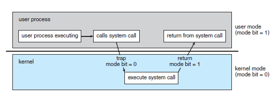

# 🗯️ 시스템 콜

<br>

`Q. 시스템 콜이란?`

```
시스템 호출(system call)은 운영 체제의 커널이 제공하는 서비스에 대해,
응용 프로그램의 요청에 따라 '커널에 접근하기 위한 인터페이스'이다.
보통 C나 C++과 같은 고급 언어로 작성된 프로그램들은 직접 시스템 호출을 사용할 수 없기 때문에
고급 API를 통해 시스템 호출에 접근하게 하는 방법이다.
```

:bulb: **커널**
```
운영 체제의 핵심, 하드웨어와 응용 프로그램 사이에서 인터페이스를 제공하며,  
컴퓨터 자원을 관리하는 역할을 한다.
```

<br>

### 시스템 콜은 왜 필요할까?

```
우리가 일반적으로 사용하는 프로그램은 '응용프로그램'이다.
유저 레벨의 프로그램은 유저 레벨의 함수들 만으로는 많은 기능을 구현하기 힘들기 때문에,
커널(kernel)의 도움을 반드시 받아야 한다.
이러한 작업은 응용프로그램으로 대표되는 유저 프로세스(User Process)에서, 즉 유저 모드에서는 수행할 수 없다.
반드시 커널에 관련된 것은 커널 모드로 전환한 후에야, 해당 작업을 수행할 권한이 생긴다.
커널 모드를 통한 이러한 작업은 반드시 시스템 콜을 통해 수행하도록 설계되어 있다. 
```



```
그렇다면 권한은 왜 필요한 것일까?
그 이유는 해커가 피해를 입히기 위해 악의적으로 시스템 콜을 사용하는 경우나
초보 사용자가 하드웨어 명령어를 잘 몰라서 아무렇게 함수를 호출했을 경우에
시스템 전체를 망가뜨릴 수도 있기 때문이다.
따라서 이러한 명령어들은 특별하게 커널 모드에서만 실행할 수 있도록 설계되었고,
만약 유저 모드에서 시스템 콜을 호출할 경우에는
운영체제에서 불법적인 접근이라 여기고 trap을 발생시킨다.
```

:bulb: **유저모드, 커널모드?**

```
사용자와 OS는 시스템 자원을 공유한다.
따라서 OS의 안전과 적절한 동작을 위해 보호 장치가 필요하므로
사용자가 수행하는 코드와 OS가 수행하는 코드를 구분해야 한다.
이 두 연산을 유저 모드와, 커널 모드로 구분한다.

유저 모드: 제어권이 사용자에게 있고, 사용자 수준의 코드가 수행 됨.
커널 모드: 제어권이 OS에게 있고, OS 코드가 수행 됨.
```

<br>

### 시스템 콜의 종류

-  **프로세스 컨트롤**
    - 프로세스 생성 및 종료
    - 메모리에 로드, 실행
    - 프로세스 속성 값 확인, 지정
    - wait 이벤트, signal 이벤트
    - 메모리 할당

- **파일 메니지먼트**
    - 파일 생성, 파일 삭제
    - 열기, 닫기
    - 읽기, 쓰기, Reposition
    - 파일 속성 값 확인, 지정

- **디바이스 매니지먼트**
    - 디바이스 요청 및 해제
    - 읽기, 쓰기, Reposition
    - 디바이스 속성 확인, 지정
    - 비 물리적인 디바이스 해제 및 장착

- **정보 관리**
    - 시간 확인, 시간 지정
    - 시스템 데이터 확인, 지정
    - 프로세스, 파일, 디바이스 속성 가져오기
    - 프로세스, 파일, 디바이스 속성 설정하기

- **커뮤니케이션**
    - 커뮤니케이션 연결 생성 및 삭제
    - 메시지 송신, 수신
    - 상태 정보 전달
    - remote 디바이스 해제 및 장착

- **보안**
    - Permission 획득
    - Permission 설정
