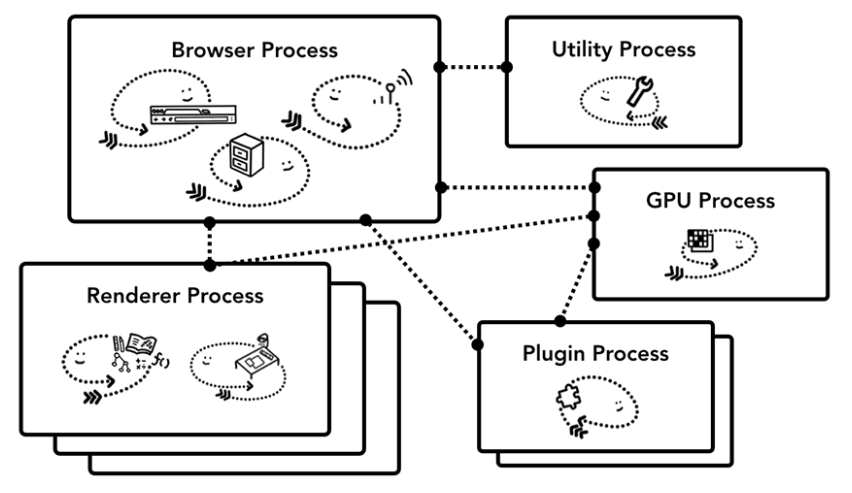
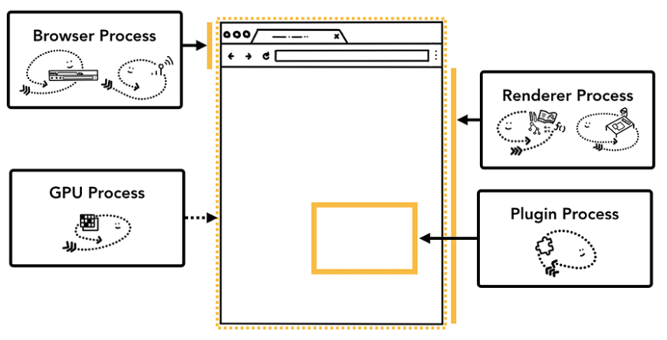
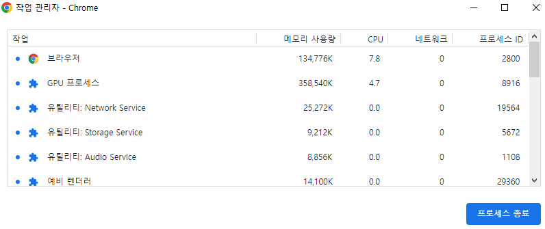
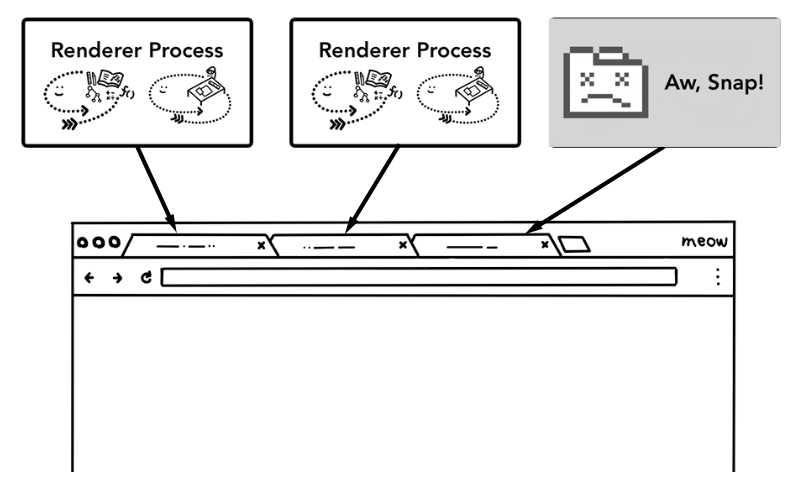

# 🗯크롬 탭이 프로세스인지 스레드인지 설명

```
Q. 크롬 탭은 프로세스와 스레드 중 무엇으로 실행되나요?
```

```
크롭 탭은 프로세스로 동작됩니다. 크롬 아키텍쳐는 여러 단위로 프로세스를 쪼개는데 그 종류로는 브라우저 프로세스, 렌더러 프로세스, GPU 프로세스 등이 있습니다. 프로세스로 구성하며 얻을 수 있는 이점으로는 두 가지가 있습니다. 첫 번째로는 각각의 탭이 독립적인 프로세스로 구동되면서 하나의 탭이 오류로 인해 종료되더라도 다른 탭들에 영향을 주지 않는다는 점입니다. 두 번째로는 각 프로세스마다 접근 권한을 따로 설정해두어서 웹 보안에 이점을 얻는 다는 것입니다. 단점으로는 프로세스가 각각 독립된 메모리 공간을 가지기 때문에 메모리 점유율이 커진다는 점입니다. 이를 해결하기 위해서 크롬은 메모리 상태에 따라서 탭마다 독립적으로 할당했던 프로세스를 하나로 합치기도 하면서 메모리를 관리하고 있습니다.
```


### Chrome의 아키텍쳐

 제일 위에 있는 브라우저 프로세스는 애플리케이션의 각 부분을 맡고 있는 다른 프로세스를 조정한다. 랜더러 프로세스는 여러 개가 만들어져 각 탭마다 할당된다.




### 프로세스의 담당 역할

다음은 Chrome의 각 프로세스가 무엇을 제어하는지 설명하는 표이다.

| 프로세스          | 프로세스가 제어하는 부분                                     |
| ----------------- | ------------------------------------------------------------ |
| 브라우저 프로세스 | 주소 표시줄, 북마크 막대, 뒤로 가기 버튼, 앞으로 가기 버튼 등 애플리케이션의 "chrome" 부분을 제어한다. 네트워크 요청이나 파일 접근과 같이 눈에 보이지는 않지만 권한이 필요한 부분도 처리한다. |
| 렌더러 프로세스   | 탭 안에서 웹 사이트가 표시되는 부분의 모든 것을 제어한다.    |
| 플러그인 프로세스 | 웹 사이트에서 사용하는 플러그인(예: Flash)을 제어한다.       |
| GPU 프로세스      | GPU 작업을 다른 프로세스와 격리해서 처리한다. GPU는 여러 애플리케이션의 요청을 처리하고 같은 화면에 요청받은 내용을 그리기 때문에 GPU 프로세스는 별도 프로세스로 분리되어 있다. |





> 도구 더보기 > 작업관리자를 선택하면, 현재 실행 중인 프로세스 목록과 사용 중인 CPU, 메모리의 양이 표시된 창이 열린다.


### 다중 프로세스 아키텍처가 Chrome에 주는 이점

1. Chrome은 각 탭마다 독립적인 렌더러 프로세스를 실행한다. 이때 한 탭이 응답하지 않더라도 그 탭만 닫고 다른 탭으로 이동할 수 있다. 만약 모든 탭이 하나의 프로세스에서 실행 중이었다면 탭이 하나만 응답하지 않아도 모든 탭이 응답하지 못하게 된다.




2. 브라우저의 작업을 여러 프로세스에 나눠 처리하는 방법의 또 다른 장점은 보안과 격리(sandbox)이다. 운영체제를 통해 프로세스의 권한을 제한할 수 있어 브라우저는 특정 프로세스가 특정 기능을 사용할 수 없게 제한할 수 있다. 즉 웹 페이지 실행 시 임의의 파일에 접근하지 못하게 제한할 수 있다는 의미이다.


출처: https://d2.naver.com/helloworld/2922312