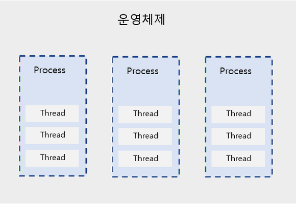

# 🗯 프로세스와 스레드의 차이

```
Q. 프로세스와 스레드의 차이점은 무엇인가요?
```

```
프로세스는 메모리 상에서 실행중인 프로그램을 말하며,
스레드는 이 프로세스 안에서 실행되는 흐름 단위를 말합니다.
프로세스는 최소 하나의 스레드를 가지고 있고, 각각 별도의 주소공간인 Code, Data, Stack, Heap을 독립적으로 할당 받습니다.
스레드는 이 중에서 stack만을 따로 할당받고 나머지 영역은 스레드끼리 공유하는 특징을 가집니다.
```

> 프로세스와 스레드의 동작원리, 정의, 특징에 대한 이해 필요

---

### 정의

✔ **프로세스**: 운영체제로부터 자원을 할당받은 작업의 단위

✔ **스레드**: 프로세스가 할당받은 자원을 이용하는 실행 흐름의 단위

> ✔ 프로그램: 파일이 저장 장치에 저장되어 있지만 메모리에는 올라가 있지 않은 정적인 상태
>
> -> 운영체제가 프로그램에 독립적인 메모리 공간을 할당해주지 않았고, 실행되지 않은 상태라는 의미



### 스레드 생성 이유?

- 프로세스의 생성 및 소멸에 따른 오버헤드 감소
- 빠른 컨텍스트 스위칭(문맥 교환)

- 프로세스들의 통신 시간, 방법 어려움 해소
- 프로세스보다 크기가 작은 실행 단위 필요

> 과거에 비해 프로그램이 커지고 복잡해지면서 나누어서 사용하는 방법을 찾기 시작했다. 직관적으로는 프로세스를 여러 개 실행하면 되겠지만, 운영체제는 안정성을 위해 프로세스마다 자신에게 할당된 메모리에만 접근하도록 제약을 걸었기에 서로간의 정보 접근이 상대적으로 어렵고 까다로웠다. 그렇기에 프로세스 내에서 메모리를 공유하며 실행할 수 있는 스레드를 탄생시켰고, 여러 프로세스를 만들 때 발생하는 오버 헤드를 줄이고 한 개의 프로세스 내에서 여러 스레드를 실행시킬 수 있게 되었다.


### 프로세스와 스레드의 메모리 사용 특징

✅ **프로세스들이 운영체제로부터 별도의 메모리 영역을 할당받은 모습**

-> 프로세스마다 각각 독립된 메모리 영역인 Code/Data/Stack/Heap의 형식으로 할당해 준다. 각각 독립된 메모리 영역을 할당해 주기 때문에 프로세스는 다른 프로세스의 변수나 자료에 접근할 수 없다.


**✅ 스레드들이 프로세스의 Code/Data/Heap 메모리 영역을 공유하는 모습**

-> 스레드는 프로세스가 할당받은 메모리 영역 내에서 Stack 형식으로 할당된 메모리 영역은 따로 할당받고, 나머지 Code/Data/Heap 형식으로 할당된 메모리 영역을 공유한다. 따라서 각각의 스레드는 별도의 스택을 가지고 있지만 힙 메모리는 서로 읽고 쓸 수 있게 된다.


⛔ 이 특징들을 통해 프로세스와 스레드의 중요한 차이를 알 수 있게 된다. 만약 한 프로세스를 실행하다가 오류가 발생해서 프로세스가 강제로 종료된다해도 **프로세스들은 서로 독립적인 특성**을 가지고 있기 때문에 다른 프로세스에 영향을 주지 못한다. 하지만, 스레드의 경우 Code/Data/Heap 메모리 영역의 내용을 **공유하기 때문에** 어떤 스레드 하나에서 오류가 발생하면 같은 프로세스 내의 다른 스레드 모두가 강제로 종료된다.